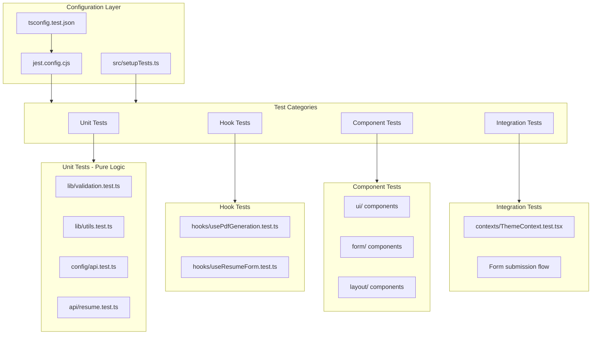

# Frontend Testing Architecture

## Overview

Unit and integration testing for the Resume Builder frontend using **Jest** with **React Testing Library**. Tests cover utilities, validation logic, hooks, context providers, API layer, and React components.

## Architecture Diagram



---

## Technology Stack

| Technology | Purpose |
|------------|---------|
| Jest 30 | Test runner and assertion library |
| ts-jest 29 | TypeScript transformer for Jest |
| @testing-library/react | Component rendering and queries |
| @testing-library/jest-dom | Custom DOM matchers (`toBeInTheDocument`, etc.) |
| @testing-library/user-event | Simulates real user interactions |
| jest-environment-jsdom | Browser-like DOM environment |
| identity-obj-proxy | Mocks CSS/SCSS module imports |

---

## Configuration Files

### `jest.config.cjs`

Root-level Jest configuration (CommonJS — required because `package.json` has `"type": "module"`).

- **Preset**: `ts-jest`
- **Environment**: `jest-environment-jsdom`
- **Transform**: `ts-jest` with `tsconfig.test.json`
- **Path alias**: `@/*` maps to `<rootDir>/src/*`
- **CSS mocking**: `identity-obj-proxy`
- **Setup file**: `src/setupTests.ts`

### `tsconfig.test.json`

Extends the app tsconfig but overrides for Jest compatibility:

- Replaces `"types": ["vite/client"]` with `["jest", "@testing-library/jest-dom"]`
- Uses `"moduleResolution": "node"` (ts-jest requires this)
- Omits `verbatimModuleSyntax` (incompatible with ts-jest)
- Adds `"esModuleInterop": true`

### `src/setupTests.ts`

Global test setup that runs before every test suite:

- Imports `@testing-library/jest-dom` for extended matchers
- Mocks `localStorage` (in-memory implementation)
- Mocks `window.matchMedia` (defaults to light mode)
- Mocks `import.meta.env` via `globalThis`
- Mocks `URL.createObjectURL` / `URL.revokeObjectURL`
- Mocks `ResizeObserver` (required by Radix UI components)

---

## Test Directory Structure

Tests are co-located with source files using `__tests__/` directories:

```
src/
├── lib/
│   └── __tests__/
│       ├── validation.test.ts        # Zod schemas, date helpers
│       └── utils.test.ts             # cn() utility
│
├── config/
│   └── __tests__/
│       └── api.test.ts               # API config, version compatibility
│
├── api/
│   └── __tests__/
│       └── resume.test.ts            # API functions with fetch mocking
│
├── hooks/
│   └── __tests__/
│       ├── usePdfGeneration.test.ts  # PDF generation hook
│       └── useResumeForm.test.ts     # Form state management hook
│
├── contexts/
│   └── __tests__/
│       └── ThemeContext.test.tsx      # Theme provider integration
│
└── components/
    ├── layout/
    │   ├── __tests__/
    │   │   ├── Footer.spec.tsx
    │   │   ├── Header.spec.tsx
    │   │   ├── SplitPane.spec.tsx
    │   │   ├── PreviewPanel.spec.tsx
    │   │   ├── ResumeFormPanel.spec.tsx
    │   │   └── ResumeBuilderLayout.spec.tsx
    │   └── __mocks__/
    │       ├── Footer.tsx
    │       ├── Header.tsx
    │       ├── SplitPane.tsx
    │       ├── PreviewPanel.tsx
    │       └── ResumeFormPanel.tsx
    ├── ui/
    │   └── __tests__/
    │       ├── button.test.tsx
    │       └── input.test.tsx
    └── form/
        ├── __tests__/
        │   └── PersonalInfoForm.test.tsx
        └── __mocks__/
            └── index.tsx
```

---

## Test Categories and Priority

### Priority 1 — Unit Tests (Pure Logic)

Highest value tests — pure functions with no React dependencies.

#### `src/lib/validation.ts`

The richest test target in the frontend. Tests cover:

- **`parseDate()`**: Handles `"Jan 2022"`, `"2022"`, `"Present"`, invalid strings, empty input
- **`isDateInFuture()`**: Past dates, today, future dates, `"Present"` always returns false
- **`isValidEndDateForWorkStatus()`**: All combinations of `currentlyWorking` true/false with `"Present"` / non-Present end dates
- **Zod schemas** (each schema tested for valid data, required field failures, and edge cases):
  - `personalInfoSchema`: name, location, phone, email validation, optional LinkedIn
  - `experienceSchema`: required fields, date refinements, bullet char limits, date ordering
  - `educationSchema`: required fields, year range validation
  - `projectSchema`: required fields, optional URL validation
  - `profileLinksSchema`: optional URL fields
  - `skillsSchema`: optional with defaults
  - `achievementSchema`: required bullet, 100-char limit without spaces
  - `resumeSchema`: full composition

#### `src/lib/utils.ts`

- `cn()`: Merges Tailwind classes, handles conflicts, empty inputs, conditional classes

#### `src/config/api.ts`

- `isVersionCompatible()`: Matching/mismatching major versions
- `API_ENDPOINTS`: Correct URL construction
- `REQUEST_CONFIG`: Expected headers and timeout

> **Note**: `api.ts` uses `import.meta.env` which `ts-jest` cannot parse natively. Tests must mock the entire module or use the `globalThis.importMetaEnv` approach from `setupTests.ts`.

### Priority 2 — Hook and API Tests

#### `src/api/resume.ts`

Tests use `global.fetch = jest.fn()` to mock network calls:

- `generatePdf()`: Success returns Blob, HTTP errors throw `ApiError` with status, timeout triggers abort
- `healthCheck()`: Returns `true` on 200, `false` on network error
- `detailedHealthCheck()`: Healthy, degraded, and unhealthy states; version compatibility check
- `getTemplates()`: Returns templates array, handles errors gracefully
- `ApiError` class: Correct name, status, endpoint properties

#### `src/hooks/usePdfGeneration.ts`

Uses `renderHook` from `@testing-library/react`:

- `generate()`: Sets `isLoading` during generation, creates object URL on success, sets `error` on failure
- `downloadPdf()`: Creates anchor element, triggers click, removes element
- Memory cleanup: Revokes previous object URL before creating new one

#### `src/hooks/useResumeForm.ts`

- Form initializes with correct default values
- `addExperience()`: Appends new experience entry with nanoid
- `addEducation()` / `addProject()` / `addAchievement()`: Append entries
- `addBullet()`: Prepends empty bullet to experience
- `removeBullet()`: Removes bullet at index, prevents removing last bullet
- `toggleCurrentlyWorking()`: Sets `endDate` to `"Present"` when true, clears when false

### Priority 3 — Context and UI Component Tests

#### `src/contexts/ThemeContext.tsx`

Integration tests with `render` and provider wrapper:

- `ThemeProvider` reads initial theme from `localStorage`
- `setTheme()` updates both `localStorage` and DOM `classList`
- System theme detection via `matchMedia` mock
- `useTheme()` throws when used outside `ThemeProvider`

#### UI Components (`button`, `input`)

- Renders without crashing
- Applies variant/size classes correctly
- Forwards refs and event handlers
- Handles disabled state

### Priority 4 — Form Component Tests

- Form sections render all expected fields
- User input updates form state
- Validation errors display on invalid input
- Dynamic array operations (add/remove experience entries, bullets)

---

## Coverage Configuration

### Thresholds

| Metric | Target |
|--------|--------|
| Statements | 60% |
| Branches | 50% |
| Functions | 60% |
| Lines | 60% |

### Collection Scope

Coverage is collected from `src/**/*.{ts,tsx}` **excluding**:

- `src/main.tsx` — Entry point
- `src/App.tsx` — Root component
- `src/**/*.d.ts` — Type declarations
- `src/components/ui/**` — Thin shadcn/ui wrappers
- `src/**/__tests__/**` — Test files
- `src/**/__mocks__/**` — Mock files
- `src/setupTests.ts` — Test setup

---

## CI Integration

The GitHub Actions workflow (`.github/workflows/rb_unit-tests.yml`) runs:

```bash
npm test -- --coverage --watchAll=false
```

- `--watchAll=false`: Disables Jest watch mode for CI
- `--coverage`: Generates coverage report in `coverage/`
- Coverage artifacts uploaded with 7-day retention

---

## Mocking Patterns

### Global Mocks (in `setupTests.ts`)

| Mock | Reason |
|------|--------|
| `localStorage` | `ThemeContext` reads/writes theme preference |
| `matchMedia` | `ThemeContext` detects system color scheme |
| `URL.createObjectURL` | `usePdfGeneration` creates download URLs |
| `URL.revokeObjectURL` | Memory cleanup in PDF hook |
| `ResizeObserver` | Required by Radix UI components |

### Per-Test Mocks

| Pattern | Usage |
|---------|-------|
| `global.fetch = jest.fn()` | API layer tests |
| `jest.mock("@/api/resume")` | Hook tests that call API |
| `jest.mock("nanoid")` | Deterministic IDs in form hook tests |
| `jest.mock("./ChildComponent")` | Isolate parent component tests |

---

## Running Tests

```bash
# Run all tests
npm test

# Run in watch mode (re-runs on file changes)
npm run test:watch

# Run with coverage report
npm run test:coverage

# Run a specific test file
npx jest src/lib/__tests__/validation.test.ts

# Run tests matching a pattern
npx jest --testPathPattern="hooks"
```
